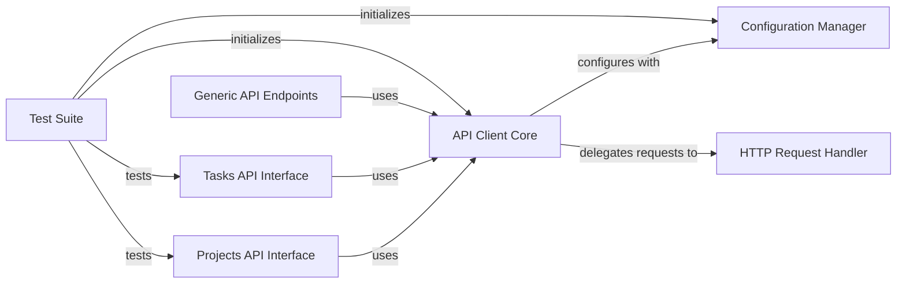

## Component Details

This architecture outlines the core components of the Asana API client, focusing on how API requests are configured, executed, and how different API resources are exposed. The central API Client Core orchestrates the entire process, relying on a Configuration Manager for settings and an HTTP Request Handler for network communication. Various API Interfaces provide high-level access to specific Asana resources, all leveraging the core client. A Test Suite ensures the correctness and reliability of these components.

### Configuration Manager
Manages all the configuration settings for the Asana API client, including host, authentication, logging, SSL, and retry strategies.

**Related Classes/Methods**:

- <a href="https://github.com/Asana/python-asana/blob/master/asana/configuration.py#L40-L270" target="_blank" rel="noopener noreferrer">`asana.configuration.Configuration` (40:270)</a>

### HTTP Request Handler
Responsible for executing low-level HTTP requests to the Asana API. It uses urllib3 and handles different HTTP methods, timeouts, and SSL verification.

**Related Classes/Methods**:

- <a href="https://github.com/Asana/python-asana/blob/master/asana/rest.py#L52-L291" target="_blank" rel="noopener noreferrer">`asana.rest.RESTClientObject` (52:291)</a>
- <a href="https://github.com/Asana/python-asana/blob/master/asana/rest.py#L228-L234" target="_blank" rel="noopener noreferrer">`asana.rest.RESTClientObject.GET` (228:234)</a>
- <a href="https://github.com/Asana/python-asana/blob/master/asana/rest.py#L236-L242" target="_blank" rel="noopener noreferrer">`asana.rest.RESTClientObject.HEAD` (236:242)</a>
- <a href="https://github.com/Asana/python-asana/blob/master/asana/rest.py#L244-L252" target="_blank" rel="noopener noreferrer">`asana.rest.RESTClientObject.OPTIONS` (244:252)</a>
- <a href="https://github.com/Asana/python-asana/blob/master/asana/rest.py#L263-L271" target="_blank" rel="noopener noreferrer">`asana.rest.RESTClientObject.POST` (263:271)</a>
- <a href="https://github.com/Asana/python-asana/blob/master/asana/rest.py#L273-L281" target="_blank" rel="noopener noreferrer">`asana.rest.RESTClientObject.PUT` (273:281)</a>
- <a href="https://github.com/Asana/python-asana/blob/master/asana/rest.py#L283-L291" target="_blank" rel="noopener noreferrer">`asana.rest.RESTClientObject.PATCH` (283:291)</a>
- <a href="https://github.com/Asana/python-asana/blob/master/asana/rest.py#L254-L261" target="_blank" rel="noopener noreferrer">`asana.rest.RESTClientObject.DELETE` (254:261)</a>
- <a href="https://github.com/Asana/python-asana/blob/master/asana/rest.py#L294-L319" target="_blank" rel="noopener noreferrer">`asana.rest.ApiException` (294:319)</a>

### API Client Core
The central component that orchestrates API calls. It handles request serialization, parameter formatting, authentication, and response deserialization, delegating actual HTTP requests to the HTTP Request Handler.

**Related Classes/Methods**:

- <a href="https://github.com/Asana/python-asana/blob/master/asana/api_client.py#L33-L627" target="_blank" rel="noopener noreferrer">`asana.api_client.ApiClient` (33:627)</a>
- <a href="https://github.com/Asana/python-asana/blob/master/asana/api_client.py#L65-L91" target="_blank" rel="noopener noreferrer">`asana.api_client.ApiClient.__init__` (65:91)</a>
- <a href="https://github.com/Asana/python-asana/blob/master/asana/api_client.py#L290-L355" target="_blank" rel="noopener noreferrer">`asana.api_client.ApiClient.call_api` (290:355)</a>
- <a href="https://github.com/Asana/python-asana/blob/master/asana/api_client.py#L357-L416" target="_blank" rel="noopener noreferrer">`asana.api_client.ApiClient.request` (357:416)</a>
- <a href="https://github.com/Asana/python-asana/blob/master/asana/api_client.py#L187-L227" target="_blank" rel="noopener noreferrer">`asana.api_client.ApiClient:sanitize_for_serialization` (187:227)</a>
- <a href="https://github.com/Asana/python-asana/blob/master/asana/api_client.py#L229-L251" target="_blank" rel="noopener noreferrer">`asana.api_client.ApiClient:deserialize` (229:251)</a>
- <a href="https://github.com/Asana/python-asana/blob/master/asana/api_client.py#L253-L288" target="_blank" rel="noopener noreferrer">`asana.api_client.ApiClient:__deserialize` (253:288)</a>
- <a href="https://github.com/Asana/python-asana/blob/master/asana/api_client.py#L587-L602" target="_blank" rel="noopener noreferrer">`asana.api_client.ApiClient:__deserialize_date` (587:602)</a>
- <a href="https://github.com/Asana/python-asana/blob/master/asana/api_client.py#L604-L624" target="_blank" rel="noopener noreferrer">`asana.api_client.ApiClient:__deserialize_datatime` (604:624)</a>

### Tasks API Interface
Provides a high-level interface for interacting with Asana tasks, including operations like creating, deleting, duplicating, and retrieving tasks, as well as managing task relationships.

**Related Classes/Methods**:

- `asana.api.tasks_api.TasksApi` (full file reference)
- `asana.api.tasks_api.TasksApi.create_task` (full file reference)

### Projects API Interface
Offers a high-level interface for managing Asana projects, enabling operations such as creating, deleting, duplicating, and retrieving projects, and accessing project-related task counts.

**Related Classes/Methods**:

- `asana.api.projects_api.ProjectsApi` (full file reference)
- `asana.api.projects_api.ProjectsApi.create_project` (full file reference)

### Generic API Endpoints
Represents a collection of other specific API interfaces for various Asana resources (e.g., Batch, Audit Log, Custom Fields, Users, Teams, etc.), all of which utilize the core API client for their operations.

**Related Classes/Methods**:

- <a href="https://github.com/Asana/python-asana/blob/master/asana/api/batch_api_api.py#L23-L178" target="_blank" rel="noopener noreferrer">`asana.api.batch_api_api.BatchAPIApi` (23:178)</a>
- <a href="https://github.com/Asana/python-asana/blob/master/asana/api/audit_log_api_api.py#L23-L189" target="_blank" rel="noopener noreferrer">`asana.api.audit_log_api_api.AuditLogAPIApi` (23:189)</a>
- <a href="https://github.com/Asana/python-asana/blob/master/asana/api/custom_field_settings_api.py#L23-L325" target="_blank" rel="noopener noreferrer">`asana.api.custom_field_settings_api.CustomFieldSettingsApi` (23:325)</a>
- <a href="https://github.com/Asana/python-asana/blob/master/asana/api/user_task_lists_api.py#L23-L317" target="_blank" rel="noopener noreferrer">`asana.api.user_task_lists_api.UserTaskListsApi` (23:317)</a>
- <a href="https://github.com/Asana/python-asana/blob/master/asana/api/time_periods_api.py#L23-L322" target="_blank" rel="noopener noreferrer">`asana.api.time_periods_api.TimePeriodsApi` (23:322)</a>
- <a href="https://github.com/Asana/python-asana/blob/master/asana/api/rules_api.py#L23-L178" target="_blank" rel="noopener noreferrer">`asana.api.rules_api.RulesApi` (23:178)</a>
- <a href="https://github.com/Asana/python-asana/blob/master/asana/api/users_api.py#L23-L762" target="_blank" rel="noopener noreferrer">`asana.api.users_api.UsersApi` (23:762)</a>
- <a href="https://github.com/Asana/python-asana/blob/master/asana/api/memberships_api.py#L23-L731" target="_blank" rel="noopener noreferrer">`asana.api.memberships_api.MembershipsApi` (23:731)</a>
- <a href="https://github.com/Asana/python-asana/blob/master/asana/api/project_statuses_api.py#L23-L602" target="_blank" rel="noopener noreferrer">`asana.api.project_statuses_api.ProjectStatusesApi` (23:602)</a>
- <a href="https://github.com/Asana/python-asana/blob/master/asana/api/project_templates_api.py#L23-L743" target="_blank" rel="noopener noreferrer">`asana.api.project_templates_api.ProjectTemplatesApi` (23:743)</a>
- <a href="https://github.com/Asana/python-asana/blob/master/asana/api/jobs_api.py#L23-L172" target="_blank" rel="noopener noreferrer">`asana.api.jobs_api.JobsApi` (23:172)</a>
- <a href="https://github.com/Asana/python-asana/blob/master/asana/api/project_briefs_api.py#L23-L604" target="_blank" rel="noopener noreferrer">`asana.api.project_briefs_api.ProjectBriefsApi` (23:604)</a>
- <a href="https://github.com/Asana/python-asana/blob/master/asana/api/typeahead_api.py#L23-L187" target="_blank" rel="noopener noreferrer">`asana.api.typeahead_api.TypeaheadApi` (23:187)</a>
- <a href="https://github.com/Asana/python-asana/blob/master/asana/api/status_updates_api.py#L23-L602" target="_blank" rel="noopener noreferrer">`asana.api.status_updates_api.StatusUpdatesApi` (23:602)</a>
- <a href="https://github.com/Asana/python-asana/blob/master/asana/api/webhooks_api.py#L23-L746" target="_blank" rel="noopener noreferrer">`asana.api.webhooks_api.WebhooksApi` (23:746)</a>
- `asana.api.sections_api.SectionsApi` (full file reference)
- `asana.api.goals_api.GoalsApi` (full file reference)
- <a href="https://github.com/Asana/python-asana/blob/master/asana/api/organization_exports_api.py#L23-L314" target="_blank" rel="noopener noreferrer">`asana.api.organization_exports_api.OrganizationExportsApi` (23:314)</a>
- <a href="https://github.com/Asana/python-asana/blob/master/asana/api/custom_types_api.py#L23-L179" target="_blank" rel="noopener noreferrer">`asana.api.custom_types_api.CustomTypesApi` (23:179)</a>
- <a href="https://github.com/Asana/python-asana/blob/master/asana/api/teams_api.py#L23-L998" target="_blank" rel="noopener noreferrer">`asana.api.teams_api.TeamsApi` (23:998)</a>
- <a href="https://github.com/Asana/python-asana/blob/master/asana/api/allocations_api.py#L23-L744" target="_blank" rel="noopener noreferrer">`asana.api.allocations_api.AllocationsApi` (23:744)</a>
- <a href="https://github.com/Asana/python-asana/blob/master/asana/api/workspaces_api.py#L23-L895" target="_blank" rel="noopener noreferrer">`asana.api.workspaces_api.WorkspacesApi` (23:895)</a>
- <a href="https://github.com/Asana/python-asana/blob/master/asana/api/events_api.py#L23-L177" target="_blank" rel="noopener noreferrer">`asana.api.events_api.EventsApi` (23:177)</a>
- `asana.api.custom_fields_api.CustomFieldsApi` (full file reference)
- `asana.api.tags_api.TagsApi` (full file reference)
- <a href="https://github.com/Asana/python-asana/blob/master/asana/api/goal_relationships_api.py#L23-L761" target="_blank" rel="noopener noreferrer">`asana.api.goal_relationships_api.GoalRelationshipsApi` (23:761)</a>
- <a href="https://github.com/Asana/python-asana/blob/master/asana/api/attachments_api.py#L23-L633" target="_blank" rel="noopener noreferrer">`asana.api.attachments_api.AttachmentsApi` (23:633)</a>
- <a href="https://github.com/Asana/python-asana/blob/master/asana/api/team_memberships_api.py#L23-L616" target="_blank" rel="noopener noreferrer">`asana.api.team_memberships_api.TeamMembershipsApi` (23:616)</a>
- <a href="https://github.com/Asana/python-asana/blob/master/asana/api/portfolio_memberships_api.py#L23-L466" target="_blank" rel="noopener noreferrer">`asana.api.portfolio_memberships_api.PortfolioMembershipsApi` (23:466)</a>
- <a href="https://github.com/Asana/python-asana/blob/master/asana/api/stories_api.py#L23-L750" target="_blank" rel="noopener noreferrer">`asana.api.stories_api.StoriesApi` (23:750)</a>
- <a href="https://github.com/Asana/python-asana/blob/master/asana/api/time_tracking_entries_api.py#L23-L750" target="_blank" rel="noopener noreferrer">`asana.api.time_tracking_entries_api.TimeTrackingEntriesApi` (23:750)</a>
- <a href="https://github.com/Asana/python-asana/blob/master/asana/api/task_templates_api.py#L23-L595" target="_blank" rel="noopener noreferrer">`asana.api.task_templates_api.TaskTemplatesApi` (23:595)</a>
- <a href="https://github.com/Asana/python-asana/blob/master/asana/api/workspace_memberships_api.py#L23-L466" target="_blank" rel="noopener noreferrer">`asana.api.workspace_memberships_api.WorkspaceMembershipsApi` (23:466)</a>
- <a href="https://github.com/Asana/python-asana/blob/master/asana/api/project_memberships_api.py#L23-L320" target="_blank" rel="noopener noreferrer">`asana.api.project_memberships_api.ProjectMembershipsApi` (23:320)</a>
- `asana.api.portfolios_api.PortfoliosApi` (full file reference)

### Test Suite
Contains test cases for verifying the functionality of the Asana API client and its various API interfaces.

**Related Classes/Methods**:

- <a href="https://github.com/Asana/python-asana/blob/master/build_tests/test_tasks_api.py#L18-L48" target="_blank" rel="noopener noreferrer">`python-asana.build_tests.test_tasks_api.TestTasksApi:setUpClass` (18:48)</a>
- <a href="https://github.com/Asana/python-asana/blob/master/build_tests/test_projects_api.py#L18-L46" target="_blank" rel="noopener noreferrer">`python-asana.build_tests.test_projects_api.TestProjectsApi:setUpClass` (18:46)</a>

### [FAQ](https://github.com/CodeBoarding/GeneratedOnBoardings/tree/main?tab=readme-ov-file#faq)