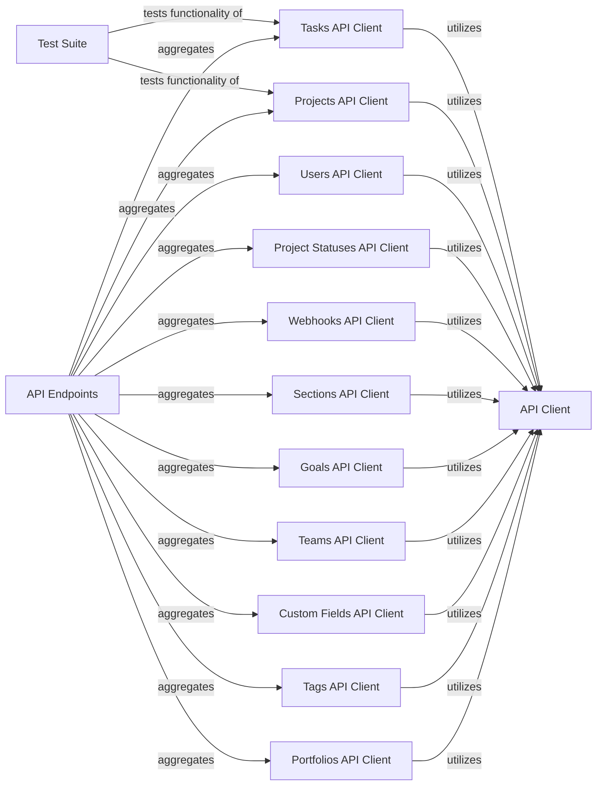

## Component Details

This system provides a comprehensive interface for interacting with the Asana API, abstracting complex API calls into distinct client components for various Asana resources like tasks, projects, and users. It includes a core API client for handling underlying HTTP communication and a test suite to ensure the functionality and reliability of the API interactions.

### API Endpoints
This component serves as a comprehensive collection of all specific API client classes, each dedicated to interacting with a particular Asana resource (e.g., Tasks, Projects, Users). It provides a unified interface to access the various Asana API functionalities, with each contained API client abstracting the specific API calls for its resource type and utilizing the core API Client for underlying communication.

**Related Classes/Methods**:

- `asana.api.tasks_api.TasksApi` (full file reference)
- `asana.api.projects_api.ProjectsApi` (full file reference)
- <a href="https://github.com/Asana/python-asana/blob/master/asana/api/users_api.py#L23-L762" target="_blank" rel="noopener noreferrer">`asana.api.users_api.UsersApi` (23:762)</a>
- <a href="https://github.com/Asana/python-asana/blob/master/asana/api/teams_api.py#L23-L998" target="_blank" rel="noopener noreferrer">`asana.api.teams_api.TeamsApi` (23:998)</a>
- `asana.api.custom_fields_api.CustomFieldsApi` (full file reference)
- `asana.api.tags_api.TagsApi` (full file reference)
- `asana.api.goals_api.GoalsApi` (full file reference)
- `asana.api.portfolios_api.PortfoliosApi` (full file reference)
- `asana.api.sections_api.SectionsApi` (full file reference)
- <a href="https://github.com/Asana/python-asana/blob/master/asana/api/webhooks_api.py#L23-L746" target="_blank" rel="noopener noreferrer">`asana.api.webhooks_api.WebhooksApi` (23:746)</a>

### Test Suite
This component contains the test cases for various Asana API functionalities, specifically for tasks and projects. It sets up and tears down test environments and interacts with the Asana API client methods to verify their behavior.

**Related Classes/Methods**:

- <a href="https://github.com/Asana/python-asana/blob/master/build_tests/test_tasks_api.py#L14-L328" target="_blank" rel="noopener noreferrer">`build_tests.test_tasks_api.TestTasksApi` (14:328)</a>
- <a href="https://github.com/Asana/python-asana/blob/master/build_tests/test_projects_api.py#L14-L258" target="_blank" rel="noopener noreferrer">`build_tests.test_projects_api.TestProjectsApi` (14:258)</a>

### Tasks API Client
This component provides a high-level interface for managing tasks in Asana. It includes methods for creating, retrieving, updating, and deleting tasks, as well as managing task relationships like dependencies, followers, projects, and tags. The public methods within this client typically delegate to internal '_with_http_info' methods for handling the underlying HTTP communication with the Asana API.

**Related Classes/Methods**:

- `asana.api.tasks_api.TasksApi` (full file reference)

### Projects API Client
This component provides a high-level interface for managing projects in Asana. It includes methods for creating, retrieving, updating, and deleting projects, as well as managing project members, followers, and custom field settings. The public methods within this client typically delegate to internal '_with_http_info' methods for handling the underlying HTTP communication with the Asana API.

**Related Classes/Methods**:

- `asana.api.projects_api.ProjectsApi` (full file reference)

### Users API Client
This component provides methods for retrieving information about users in Asana, including their favorites, and users associated with teams or workspaces. The public methods within this client typically delegate to internal '_with_http_info' methods for handling the underlying HTTP communication with the Asana API.

**Related Classes/Methods**:

- <a href="https://github.com/Asana/python-asana/blob/master/asana/api/users_api.py#L23-L762" target="_blank" rel="noopener noreferrer">`asana.api.users_api.UsersApi` (23:762)</a>

### Project Statuses API Client
This component handles operations related to project statuses in Asana, including creating, deleting, retrieving, and listing project statuses for a given project.

**Related Classes/Methods**:

- <a href="https://github.com/Asana/python-asana/blob/master/asana/api/project_statuses_api.py#L23-L602" target="_blank" rel="noopener noreferrer">`asana.api.project_statuses_api.ProjectStatusesApi` (23:602)</a>

### Webhooks API Client
This component manages webhooks in Asana, allowing for creation, deletion, retrieval, and updates of webhooks to receive notifications about events. The public methods within this client typically delegate to internal '_with_http_info' methods for handling the underlying HTTP communication with the Asana API.

**Related Classes/Methods**:

- <a href="https://github.com/Asana/python-asana/blob/master/asana/api/webhooks_api.py#L23-L746" target="_blank" rel="noopener noreferrer">`asana.api.webhooks_api.WebhooksApi` (23:746)</a>

### Sections API Client
This component provides functionalities for managing sections within Asana projects, including creating, deleting, retrieving, and updating sections, as well as adding tasks to sections. The public methods within this client typically delegate to internal '_with_http_info' methods for handling the underlying HTTP communication with the Asana API.

**Related Classes/Methods**:

- `asana.api.sections_api.SectionsApi` (full file reference)

### Goals API Client
This component handles operations related to goals in Asana, such as creating, deleting, retrieving, and updating goals and their metrics, and managing goal followers. The public methods within this client typically delegate to internal '_with_http_info' methods for handling the underlying HTTP communication with the Asana API.

**Related Classes/Methods**:

- `asana.api.goals_api.GoalsApi` (full file reference)

### Teams API Client
This component provides methods for managing teams in Asana, including creating, retrieving, updating teams, and adding/removing users from teams. The public methods within this client typically delegate to internal '_with_http_info' methods for handling the underlying HTTP communication with the Asana API.

**Related Classes/Methods**:

- <a href="https://github.com/Asana/python-asana/blob/master/asana/api/teams_api.py#L23-L998" target="_blank" rel="noopener noreferrer">`asana.api.teams_api.TeamsApi` (23:998)</a>

### Custom Fields API Client
This component manages custom fields in Asana, allowing for creation, deletion, retrieval, and updates of custom fields and their enum options. The public methods within this client typically delegate to internal '_with_http_info' methods for handling the underlying HTTP communication with the Asana API.

**Related Classes/Methods**:

- `asana.api.custom_fields_api.CustomFieldsApi` (full file reference)

### Tags API Client
This component provides methods for managing tags in Asana, including creating, deleting, retrieving, and updating tags, and associating them with tasks. The public methods within this client typically delegate to internal '_with_http_info' methods for handling the underlying HTTP communication with the Asana API.

**Related Classes/Methods**:

- `asana.api.tags_api.TagsApi` (full file reference)

### Portfolios API Client
This component manages portfolios in Asana, allowing for creation, deletion, retrieval, and updates of portfolios, and managing their custom field settings, items, and members. The public methods within this client typically delegate to internal '_with_http_info' methods for handling the underlying HTTP communication with the Asana API.

**Related Classes/Methods**:

- `asana.api.portfolios_api.PortfoliosApi` (full file reference)

### API Client
This component provides the core functionality for making HTTP requests to the Asana API. It handles authentication, request serialization, response deserialization, and error handling. It is utilized by all specific API endpoint clients.

**Related Classes/Methods**:

- <a href="https://github.com/Asana/python-asana/blob/master/asana/api_client.py#L33-L627" target="_blank" rel="noopener noreferrer">`asana.api_client.ApiClient` (33:627)</a>

### [FAQ](https://github.com/CodeBoarding/GeneratedOnBoardings/tree/main?tab=readme-ov-file#faq)