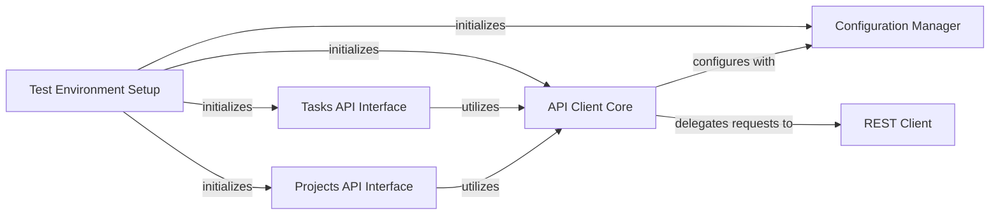

## Component Details

This graph illustrates the core components of the Asana API client, focusing on how configuration settings are managed, how API requests are processed, and how different API resources are exposed through dedicated interfaces. It also highlights the setup for testing the client's functionality.

### Configuration Manager
The Configuration Manager component is responsible for holding and managing all the global settings required for the Asana API client. This includes host URL, authentication credentials (API keys, access tokens, username/password), logging settings, SSL/TLS verification options, connection pool size, proxy settings, and retry strategies for HTTP requests.

**Related Classes/Methods**:

- <a href="https://github.com/Asana/python-asana/blob/master/asana/configuration.py#L40-L270" target="_blank" rel="noopener noreferrer">`asana.configuration.Configuration` (40:270)</a>
- <a href="https://github.com/Asana/python-asana/blob/master/asana/configuration.py#L47-L120" target="_blank" rel="noopener noreferrer">`asana.configuration.Configuration.__init__` (47:120)</a>
- <a href="https://github.com/Asana/python-asana/blob/master/asana/configuration.py#L244-L258" target="_blank" rel="noopener noreferrer">`asana.configuration.Configuration.auth_settings` (244:258)</a>

### API Client Core
The API Client Core is the central component that handles the generic client-server communication for the Asana API. It is responsible for preparing HTTP requests (sanitizing parameters, handling headers, body), deserializing responses into appropriate Python objects, and managing asynchronous requests. It relies on the Configuration Manager for settings and delegates actual HTTP calls to the REST Client.

**Related Classes/Methods**:

- <a href="https://github.com/Asana/python-asana/blob/master/asana/api_client.py#L33-L627" target="_blank" rel="noopener noreferrer">`asana.api_client.ApiClient` (33:627)</a>

### REST Client
The REST Client component is a low-level HTTP client that performs the actual network requests (GET, POST, PUT, DELETE, etc.). It interacts directly with the underlying HTTP library (urllib3) and handles the raw communication with the Asana API endpoints.

**Related Classes/Methods**:

- <a href="https://github.com/Asana/python-asana/blob/master/asana/rest.py#L52-L291" target="_blank" rel="noopener noreferrer">`asana.rest.RESTClientObject` (52:291)</a>

### Tasks API Interface
The Tasks API Interface provides a high-level, object-oriented interface for interacting with Asana's Tasks resources. It encapsulates specific API endpoints and methods related to tasks, such as creating, retrieving, updating, and deleting tasks. It uses the API Client Core to execute these operations.

**Related Classes/Methods**:

- `asana.api.tasks_api.TasksApi` (full file reference)
- `asana.api.tasks_api.TasksApi.create_task` (full file reference)

### Projects API Interface
The Projects API Interface provides a high-level, object-oriented interface for interacting with Asana's Projects resources. It encapsulates specific API endpoints and methods related to projects, such as creating, retrieving, updating, and deleting projects. It uses the API Client Core to execute these operations.

**Related Classes/Methods**:

- `asana.api.projects_api.ProjectsApi` (full file reference)
- `asana.api.projects_api.ProjectsApi.create_project` (full file reference)

### Test Environment Setup
The Test Environment Setup component is responsible for initializing the necessary configurations and API client instances required for running integration or unit tests against the Asana API. It sets up the environment before test cases are executed, ensuring that the API client is properly configured and ready to make calls.

**Related Classes/Methods**:

- <a href="https://github.com/Asana/python-asana/blob/master/build_tests/test_tasks_api.py#L18-L48" target="_blank" rel="noopener noreferrer">`python-asana.build_tests.test_tasks_api.TestTasksApi:setUpClass` (18:48)</a>
- <a href="https://github.com/Asana/python-asana/blob/master/build_tests/test_projects_api.py#L18-L46" target="_blank" rel="noopener noreferrer">`python-asana.build_tests.test_projects_api.TestProjectsApi:setUpClass` (18:46)</a>

### [FAQ](https://github.com/CodeBoarding/GeneratedOnBoardings/tree/main?tab=readme-ov-file#faq)