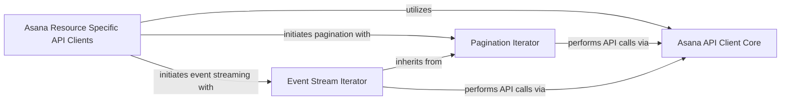

## Component Details

This architecture overview describes the core components responsible for interacting with the Asana API, handling various resource-specific operations, and efficiently managing paginated and event-stream responses. The system is designed with a clear separation of concerns, where a central API client handles low-level communication, specialized clients manage resource-specific interactions, and dedicated iterators provide robust mechanisms for data retrieval from paginated endpoints and real-time event streams.

### Asana API Client Core
This component provides the fundamental capabilities for interacting with the Asana API, including handling HTTP requests, authentication, and response parsing. It serves as the low-level interface for all API interactions.

**Related Classes/Methods**:

- <a href="https://github.com/Asana/python-asana/blob/master/asana/api_client.py#L33-L627" target="_blank" rel="noopener noreferrer">`asana.api_client.ApiClient` (33:627)</a>
- <a href="https://github.com/Asana/python-asana/blob/master/asana/rest.py#L52-L291" target="_blank" rel="noopener noreferrer">`asana.rest.RESTClientObject` (52:291)</a>

### Asana Resource Specific API Clients
These components are specialized API clients, each dedicated to a particular Asana resource (e.g., Tasks, Users, Projects). They expose high-level methods for resource-specific operations and internally leverage the Asana API Client Core for communication.

**Related Classes/Methods**:

- <a href="https://github.com/Asana/python-asana/blob/master/asana/api/allocations_api.py#L23-L744" target="_blank" rel="noopener noreferrer">`asana.api.allocations_api.AllocationsApi` (23:744)</a>
- <a href="https://github.com/Asana/python-asana/blob/master/asana/api/attachments_api.py#L23-L633" target="_blank" rel="noopener noreferrer">`asana.api.attachments_api.AttachmentsApi` (23:633)</a>
- <a href="https://github.com/Asana/python-asana/blob/master/asana/api/audit_log_api_api.py#L23-L189" target="_blank" rel="noopener noreferrer">`asana.api.audit_log_api_api.AuditLogAPIApi` (23:189)</a>
- <a href="https://github.com/Asana/python-asana/blob/master/asana/api/batch_api_api.py#L23-L178" target="_blank" rel="noopener noreferrer">`asana.api.batch_api_api.BatchAPIApi` (23:178)</a>
- <a href="https://github.com/Asana/python-asana/blob/master/asana/api/custom_field_settings_api.py#L23-L325" target="_blank" rel="noopener noreferrer">`asana.api.custom_field_settings_api.CustomFieldSettingsApi` (23:325)</a>
- `asana.api.custom_fields_api.CustomFieldsApi` (full file reference)
- <a href="https://github.com/Asana/python-asana/blob/master/asana/api/custom_types_api.py#L23-L179" target="_blank" rel="noopener noreferrer">`asana.api.custom_types_api.CustomTypesApi` (23:179)</a>
- <a href="https://github.com/Asana/python-asana/blob/master/asana/api/events_api.py#L23-L177" target="_blank" rel="noopener noreferrer">`asana.api.events_api.EventsApi` (23:177)</a>
- <a href="https://github.com/Asana/python-asana/blob/master/asana/api/goal_relationships_api.py#L23-L761" target="_blank" rel="noopener noreferrer">`asana.api.goal_relationships_api.GoalRelationshipsApi` (23:761)</a>
- `asana.api.goals_api.GoalsApi` (full file reference)
- <a href="https://github.com/Asana/python-asana/blob/master/asana/api/jobs_api.py#L23-L172" target="_blank" rel="noopener noreferrer">`asana.api.jobs_api.JobsApi` (23:172)</a>
- <a href="https://github.com/Asana/python-asana/blob/master/asana/api/memberships_api.py#L23-L731" target="_blank" rel="noopener noreferrer">`asana.api.memberships_api.MembershipsApi` (23:731)</a>
- <a href="https://github.com/Asana/python-asana/blob/master/asana/api/organization_exports_api.py#L23-L314" target="_blank" rel="noopener noreferrer">`asana.api.organization_exports_api.OrganizationExportsApi` (23:314)</a>
- <a href="https://github.com/Asana/python-asana/blob/master/asana/api/portfolio_memberships_api.py#L23-L466" target="_blank" rel="noopener noreferrer">`asana.api.portfolio_memberships_api.PortfolioMembershipsApi` (23:466)</a>
- `asana.api.portfolios_api.PortfoliosApi` (full file reference)
- <a href="https://github.com/Asana/python-asana/blob/master/asana/api/project_briefs_api.py#L23-L604" target="_blank" rel="noopener noreferrer">`asana.api.project_briefs_api.ProjectBriefsApi` (23:604)</a>
- <a href="https://github.com/Asana/python-asana/blob/master/asana/api/project_memberships_api.py#L23-L320" target="_blank" rel="noopener noreferrer">`asana.api.project_memberships_api.ProjectMembershipsApi` (23:320)</a>
- <a href="https://github.com/Asana/python-asana/blob/master/asana/api/project_statuses_api.py#L23-L602" target="_blank" rel="noopener noreferrer">`asana.api.project_statuses_api.ProjectStatusesApi` (23:602)</a>
- <a href="https://github.com/Asana/python-asana/blob/master/asana/api/project_templates_api.py#L23-L743" target="_blank" rel="noopener noreferrer">`asana.api.project_templates_api.ProjectTemplatesApi` (23:743)</a>
- `asana.api.projects_api.ProjectsApi` (full file reference)
- <a href="https://github.com/Asana/python-asana/blob/master/asana/api/rules_api.py#L23-L178" target="_blank" rel="noopener noreferrer">`asana.api.rules_api.RulesApi` (23:178)</a>
- `asana.api.sections_api.SectionsApi` (full file reference)
- <a href="https://github.com/Asana/python-asana/blob/master/asana/api/status_updates_api.py#L23-L602" target="_blank" rel="noopener noreferrer">`asana.api.status_updates_api.StatusUpdatesApi` (23:602)</a>
- <a href="https://github.com/Asana/python-asana/blob/master/asana/api/stories_api.py#L23-L750" target="_blank" rel="noopener noreferrer">`asana.api.stories_api.StoriesApi` (23:750)</a>
- `asana.api.tags_api.TagsApi` (full file reference)
- <a href="https://github.com/Asana/python-asana/blob/master/asana/api/task_templates_api.py#L23-L595" target="_blank" rel="noopener noreferrer">`asana.api.task_templates_api.TaskTemplatesApi` (23:595)</a>
- `asana.api.tasks_api.TasksApi` (full file reference)
- <a href="https://github.com/Asana/python-asana/blob/master/asana/api/team_memberships_api.py#L23-L616" target="_blank" rel="noopener noreferrer">`asana.api.team_memberships_api.TeamMembershipsApi` (23:616)</a>
- <a href="https://github.com/Asana/python-asana/blob/master/asana/api/teams_api.py#L23-L998" target="_blank" rel="noopener noreferrer">`asana.api.teams_api.TeamsApi` (23:998)</a>
- <a href="https://github.com/Asana/python-asana/blob/master/asana/api/time_periods_api.py#L23-L322" target="_blank" rel="noopener noreferrer">`asana.api.time_periods_api.TimePeriodsApi` (23:322)</a>
- <a href="https://github.com/Asana/python-asana/blob/master/asana/api/time_tracking_entries_api.py#L23-L750" target="_blank" rel="noopener noreferrer">`asana.api.time_tracking_entries_api.TimeTrackingEntriesApi` (23:750)</a>
- <a href="https://github.com/Asana/python-asana/blob/master/asana/api/typeahead_api.py#L23-L187" target="_blank" rel="noopener noreferrer">`asana.api.typeahead_api.TypeaheadApi` (23:187)</a>
- <a href="https://github.com/Asana/python-asana/blob/master/asana/api/user_task_lists_api.py#L23-L317" target="_blank" rel="noopener noreferrer">`asana.api.user_task_lists_api.UserTaskListsApi` (23:317)</a>
- <a href="https://github.com/Asana/python-asana/blob/master/asana/api/users_api.py#L23-L762" target="_blank" rel="noopener noreferrer">`asana.api.users_api.UsersApi` (23:762)</a>
- <a href="https://github.com/Asana/python-asana/blob/master/asana/api/webhooks_api.py#L23-L746" target="_blank" rel="noopener noreferrer">`asana.api.webhooks_api.WebhooksApi` (23:746)</a>
- <a href="https://github.com/Asana/python-asana/blob/master/asana/api/workspace_memberships_api.py#L23-L466" target="_blank" rel="noopener noreferrer">`asana.api.workspace_memberships_api.WorkspaceMembershipsApi` (23:466)</a>
- <a href="https://github.com/Asana/python-asana/blob/master/asana/api/workspaces_api.py#L23-L895" target="_blank" rel="noopener noreferrer">`asana.api.workspaces_api.WorkspacesApi` (23:895)</a>

### Pagination Iterator
This component provides the generic iteration logic for handling paginated responses from the Asana API. It manages the state of pagination (e.g., next_page token, item_limit) and orchestrates subsequent API calls to retrieve data pages.

**Related Classes/Methods**:

- <a href="https://github.com/Asana/python-asana/blob/master/asana/pagination/page_iterator.py#L3-L64" target="_blank" rel="noopener noreferrer">`asana.pagination.page_iterator.PageIterator` (3:64)</a>
- <a href="https://github.com/Asana/python-asana/blob/master/asana/pagination/page_iterator.py#L4-L9" target="_blank" rel="noopener noreferrer">`asana.pagination.page_iterator.PageIterator.__init__` (4:9)</a>
- <a href="https://github.com/Asana/python-asana/blob/master/asana/pagination/page_iterator.py#L15-L35" target="_blank" rel="noopener noreferrer">`asana.pagination.page_iterator.PageIterator.__next__` (15:35)</a>
- <a href="https://github.com/Asana/python-asana/blob/master/asana/pagination/page_iterator.py#L37-L39" target="_blank" rel="noopener noreferrer">`asana.pagination.page_iterator.PageIterator.next` (37:39)</a>
- <a href="https://github.com/Asana/python-asana/blob/master/asana/pagination/page_iterator.py#L41-L45" target="_blank" rel="noopener noreferrer">`asana.pagination.page_iterator.PageIterator.items` (41:45)</a>
- <a href="https://github.com/Asana/python-asana/blob/master/asana/pagination/page_iterator.py#L47-L64" target="_blank" rel="noopener noreferrer">`asana.pagination.page_iterator.PageIterator.call_api` (47:64)</a>

### Event Stream Iterator
This component specializes in iterating over real-time event streams from the Asana API. It extends the Pagination Iterator to incorporate event-specific mechanisms like sync tokens and has_more flags for continuous event fetching.

**Related Classes/Methods**:

- <a href="https://github.com/Asana/python-asana/blob/master/asana/pagination/event_iterator.py#L5-L38" target="_blank" rel="noopener noreferrer">`asana.pagination.event_iterator.EventIterator` (5:38)</a>
- <a href="https://github.com/Asana/python-asana/blob/master/asana/pagination/event_iterator.py#L6-L9" target="_blank" rel="noopener noreferrer">`asana.pagination.event_iterator.EventIterator.__init__` (6:9)</a>
- <a href="https://github.com/Asana/python-asana/blob/master/asana/pagination/event_iterator.py#L11-L38" target="_blank" rel="noopener noreferrer">`asana.pagination.event_iterator.EventIterator.__next__` (11:38)</a>

### [FAQ](https://github.com/CodeBoarding/GeneratedOnBoardings/tree/main?tab=readme-ov-file#faq)