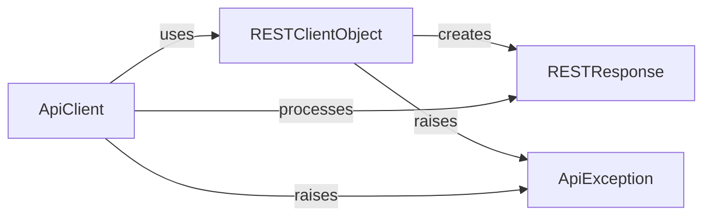

## Component Details

This subsystem handles all aspects of communication with the Asana API, from low-level HTTP requests and response parsing to higher-level API call orchestration, authentication, and error handling. It ensures reliable and structured interaction with the Asana platform.

### RESTClientObject
The RESTClientObject component is responsible for executing low-level HTTP requests to the Asana API. It manages urllib3 connection pools, handles SSL verification, and implements retry strategies. It exposes methods for standard HTTP verbs (GET, POST, PUT, DELETE, PATCH, OPTIONS, HEAD), all of which delegate to a core 'request' method. This component is also responsible for wrapping the raw urllib3 response into a RESTResponse object and raising ApiException for non-2xx HTTP responses or SSL errors.

**Related Classes/Methods**:

- <a href="https://github.com/Asana/python-asana/blob/master/asana/rest.py#L52-L291" target="_blank" rel="noopener noreferrer">`asana.rest.RESTClientObject` (52:291)</a>
- <a href="https://github.com/Asana/python-asana/blob/master/asana/rest.py#L109-L226" target="_blank" rel="noopener noreferrer">`asana.rest.RESTClientObject.request` (109:226)</a>
- <a href="https://github.com/Asana/python-asana/blob/master/asana/rest.py#L228-L234" target="_blank" rel="noopener noreferrer">`asana.rest.RESTClientObject.GET` (228:234)</a>
- <a href="https://github.com/Asana/python-asana/blob/master/asana/rest.py#L236-L242" target="_blank" rel="noopener noreferrer">`asana.rest.RESTClientObject.HEAD` (236:242)</a>
- <a href="https://github.com/Asana/python-asana/blob/master/asana/rest.py#L244-L252" target="_blank" rel="noopener noreferrer">`asana.rest.RESTClientObject.OPTIONS` (244:252)</a>
- <a href="https://github.com/Asana/python-asana/blob/master/asana/rest.py#L254-L261" target="_blank" rel="noopener noreferrer">`asana.rest.RESTClientObject.DELETE` (254:261)</a>
- <a href="https://github.com/Asana/python-asana/blob/master/asana/rest.py#L263-L271" target="_blank" rel="noopener noreferrer">`asana.rest.RESTClientObject.POST` (263:271)</a>
- <a href="https://github.com/Asana/python-asana/blob/master/asana/rest.py#L273-L281" target="_blank" rel="noopener noreferrer">`asana.rest.RESTClientObject.PUT` (273:281)</a>
- <a href="https://github.com/Asana/python-asana/blob/master/asana/rest.py#L283-L291" target="_blank" rel="noopener noreferrer">`asana.rest.RESTClientObject.PATCH` (283:291)</a>

### RESTResponse
The RESTResponse component acts as an abstraction layer over the raw urllib3 HTTP response. It provides a simplified and consistent interface to access essential response details such as the HTTP status code, reason phrase, response body data, and headers. This component is instantiated by the RESTClientObject after a successful HTTP request.

**Related Classes/Methods**:

- <a href="https://github.com/Asana/python-asana/blob/master/asana/rest.py#L35-L49" target="_blank" rel="noopener noreferrer">`asana.rest.RESTResponse` (35:49)</a>
- <a href="https://github.com/Asana/python-asana/blob/master/asana/rest.py#L37-L41" target="_blank" rel="noopener noreferrer">`asana.rest.RESTResponse.__init__` (37:41)</a>
- <a href="https://github.com/Asana/python-asana/blob/master/asana/rest.py#L43-L45" target="_blank" rel="noopener noreferrer">`asana.rest.RESTResponse.getheaders` (43:45)</a>
- <a href="https://github.com/Asana/python-asana/blob/master/asana/rest.py#L47-L49" target="_blank" rel="noopener noreferrer">`asana.rest.RESTResponse.getheader` (47:49)</a>

### ApiException
The ApiException component is a custom exception class designed to signal and encapsulate errors encountered during interactions with the Asana API. It stores detailed information about the HTTP response that led to the error, including the status code, reason, response body, and headers, facilitating structured error handling and debugging. This exception is raised by RESTClientObject for HTTP errors and by ApiClient during deserialization failures.

**Related Classes/Methods**:

- <a href="https://github.com/Asana/python-asana/blob/master/asana/rest.py#L294-L319" target="_blank" rel="noopener noreferrer">`asana.rest.ApiException` (294:319)</a>
- <a href="https://github.com/Asana/python-asana/blob/master/asana/rest.py#L296-L306" target="_blank" rel="noopener noreferrer">`asana.rest.ApiException.__init__` (296:306)</a>
- <a href="https://github.com/Asana/python-asana/blob/master/asana/rest.py#L308-L319" target="_blank" rel="noopener noreferrer">`asana.rest.ApiException.__str__` (308:319)</a>

### ApiClient
The ApiClient component serves as the primary, higher-level interface for developers to interact with the Asana API. It orchestrates the entire API call lifecycle, from preparing request parameters (including serialization of complex objects and handling authentication) to making the actual HTTP request via RESTClientObject, and finally deserializing the API response into appropriate Python data structures. It also supports asynchronous request execution using a thread pool.

**Related Classes/Methods**:

- <a href="https://github.com/Asana/python-asana/blob/master/asana/api_client.py#L33-L627" target="_blank" rel="noopener noreferrer">`asana.api_client.ApiClient` (33:627)</a>
- <a href="https://github.com/Asana/python-asana/blob/master/asana/api_client.py#L65-L91" target="_blank" rel="noopener noreferrer">`asana.api_client.ApiClient.__init__` (65:91)</a>
- <a href="https://github.com/Asana/python-asana/blob/master/asana/api_client.py#L110-L185" target="_blank" rel="noopener noreferrer">`asana.api_client.ApiClient.__call_api` (110:185)</a>
- <a href="https://github.com/Asana/python-asana/blob/master/asana/api_client.py#L290-L355" target="_blank" rel="noopener noreferrer">`asana.api_client.ApiClient.call_api` (290:355)</a>
- <a href="https://github.com/Asana/python-asana/blob/master/asana/api_client.py#L357-L416" target="_blank" rel="noopener noreferrer">`asana.api_client.ApiClient.request` (357:416)</a>
- <a href="https://github.com/Asana/python-asana/blob/master/asana/api_client.py#L187-L227" target="_blank" rel="noopener noreferrer">`asana.api_client.ApiClient.sanitize_for_serialization` (187:227)</a>
- <a href="https://github.com/Asana/python-asana/blob/master/asana/api_client.py#L229-L251" target="_blank" rel="noopener noreferrer">`asana.api_client.ApiClient.deserialize` (229:251)</a>
- <a href="https://github.com/Asana/python-asana/blob/master/asana/api_client.py#L508-L535" target="_blank" rel="noopener noreferrer">`asana.api_client.ApiClient.update_params_for_auth` (508:535)</a>

### [FAQ](https://github.com/CodeBoarding/GeneratedOnBoardings/tree/main?tab=readme-ov-file#faq)