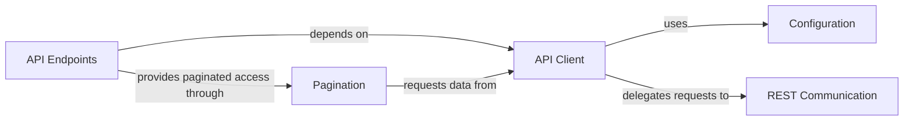

## Component Details

The `python-asana` library provides a client for interacting with the Asana API, structured around a central `API Client` that manages request lifecycle and delegates low-level HTTP communication to the `REST Communication` component. Configuration settings are handled by the `Configuration` component, which the `API Client` utilizes. Various `API Endpoints` offer a high-level interface for specific Asana resources, relying on the `API Client` for their operations. For handling large datasets, the `Pagination` component provides iterators that interact with the `API Client` to fetch paginated results efficiently.

### API Client
The central client for interacting with the Asana API. It handles request preparation, serialization, deserialization, and delegates actual HTTP communication to the REST Communication layer. It also manages user-agent and default headers.

**Related Classes/Methods**:

- <a href="https://github.com/Asana/python-asana/blob/master/asana/api_client.py#L33-L627" target="_blank" rel="noopener noreferrer">`asana.api_client.ApiClient` (33:627)</a>
- <a href="https://github.com/Asana/python-asana/blob/master/asana/api_client.py#L65-L91" target="_blank" rel="noopener noreferrer">`asana.api_client.ApiClient.__init__` (65:91)</a>
- <a href="https://github.com/Asana/python-asana/blob/master/asana/api_client.py#L290-L355" target="_blank" rel="noopener noreferrer">`asana.api_client.ApiClient.call_api` (290:355)</a>
- <a href="https://github.com/Asana/python-asana/blob/master/asana/api_client.py#L357-L416" target="_blank" rel="noopener noreferrer">`asana.api_client.ApiClient.request` (357:416)</a>

### REST Communication
Responsible for making low-level HTTP requests to the Asana API and handling responses, including error handling (ApiException). It utilizes urllib3 for managing connection pools and performing HTTP operations.

**Related Classes/Methods**:

- <a href="https://github.com/Asana/python-asana/blob/master/asana/rest.py#L52-L291" target="_blank" rel="noopener noreferrer">`asana.rest.RESTClientObject` (52:291)</a>
- <a href="https://github.com/Asana/python-asana/blob/master/asana/rest.py#L35-L49" target="_blank" rel="noopener noreferrer">`asana.rest.RESTResponse` (35:49)</a>
- <a href="https://github.com/Asana/python-asana/blob/master/asana/rest.py#L294-L319" target="_blank" rel="noopener noreferrer">`asana.rest.ApiException` (294:319)</a>
- <a href="https://github.com/Asana/python-asana/blob/master/asana/rest.py#L109-L226" target="_blank" rel="noopener noreferrer">`asana.rest.RESTClientObject.request` (109:226)</a>

### Configuration
Manages the API client's configuration settings, such as authentication credentials, host information, SSL verification, logging, and retry strategies.

**Related Classes/Methods**:

- <a href="https://github.com/Asana/python-asana/blob/master/asana/configuration.py#L40-L270" target="_blank" rel="noopener noreferrer">`asana.configuration.Configuration` (40:270)</a>
- <a href="https://github.com/Asana/python-asana/blob/master/asana/configuration.py#L47-L120" target="_blank" rel="noopener noreferrer">`asana.configuration.Configuration.__init__` (47:120)</a>
- <a href="https://github.com/Asana/python-asana/blob/master/asana/configuration.py#L244-L258" target="_blank" rel="noopener noreferrer">`asana.configuration.Configuration.auth_settings` (244:258)</a>

### API Endpoints
A collection of classes, each providing methods to interact with specific Asana resources (e.g., Tasks, Projects, Users). These classes abstract the API calls for different resource types and utilize the API Client for underlying communication.

**Related Classes/Methods**:

- `asana.api.tasks_api.TasksApi` (full file reference)
- `asana.api.projects_api.ProjectsApi` (full file reference)
- <a href="https://github.com/Asana/python-asana/blob/master/asana/api/users_api.py#L23-L762" target="_blank" rel="noopener noreferrer">`asana.api.users_api.UsersApi` (23:762)</a>
- <a href="https://github.com/Asana/python-asana/blob/master/asana/api/teams_api.py#L23-L998" target="_blank" rel="noopener noreferrer">`asana.api.teams_api.TeamsApi` (23:998)</a>
- `asana.api.custom_fields_api.CustomFieldsApi` (full file reference)
- `asana.api.tags_api.TagsApi` (full file reference)
- `asana.api.goals_api.GoalsApi` (full file reference)
- `asana.api.portfolios_api.PortfoliosApi` (full file reference)
- `asana.api.sections_api.SectionsApi` (full file reference)
- <a href="https://github.com/Asana/python-asana/blob/master/asana/api/webhooks_api.py#L23-L746" target="_blank" rel="noopener noreferrer">`asana.api.webhooks_api.WebhooksApi` (23:746)</a>

### Pagination
Provides iterators for handling paginated responses from the Asana API, allowing efficient retrieval of large datasets. It interacts with the API Client to fetch subsequent pages of data.

**Related Classes/Methods**:

- <a href="https://github.com/Asana/python-asana/blob/master/asana/pagination/page_iterator.py#L3-L64" target="_blank" rel="noopener noreferrer">`asana.pagination.page_iterator.PageIterator` (3:64)</a>
- <a href="https://github.com/Asana/python-asana/blob/master/asana/pagination/event_iterator.py#L5-L38" target="_blank" rel="noopener noreferrer">`asana.pagination.event_iterator.EventIterator` (5:38)</a>

### [FAQ](https://github.com/CodeBoarding/GeneratedOnBoardings/tree/main?tab=readme-ov-file#faq)